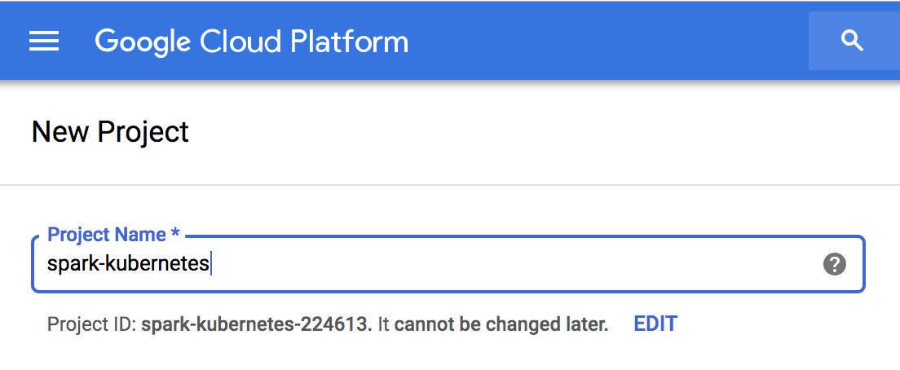
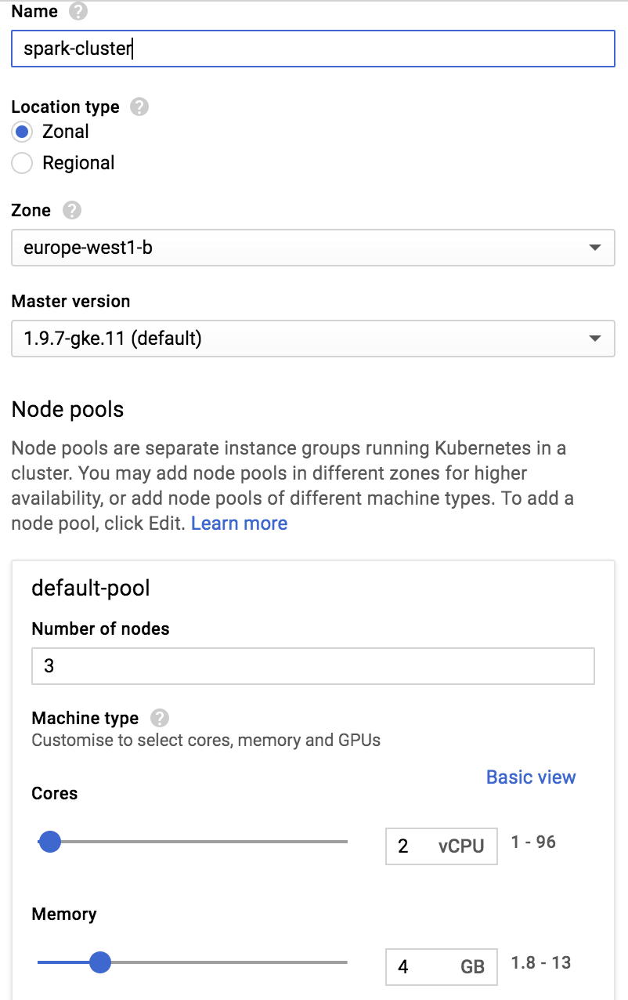
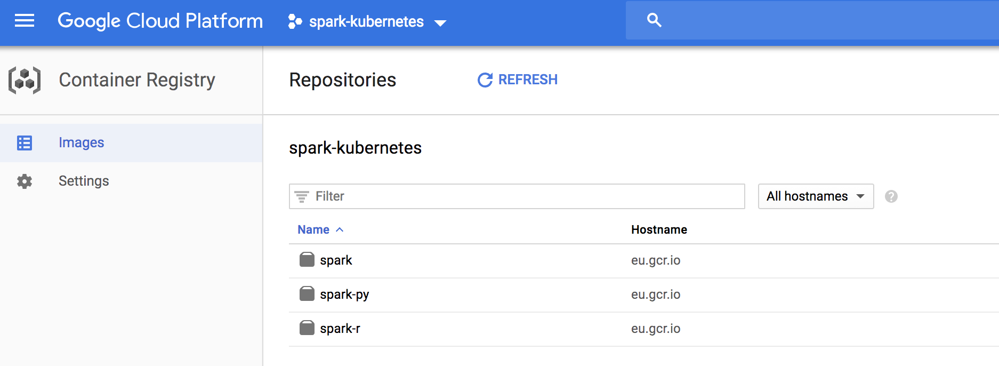
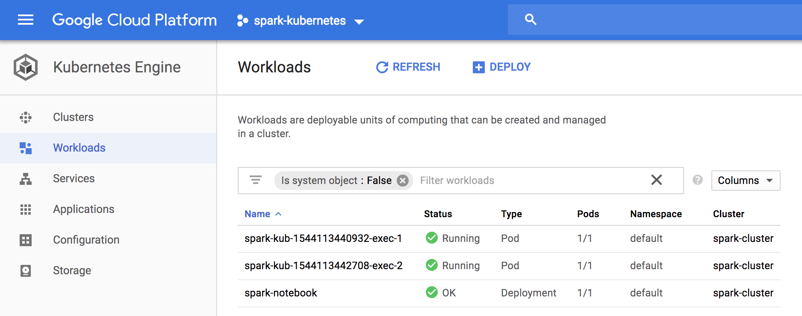
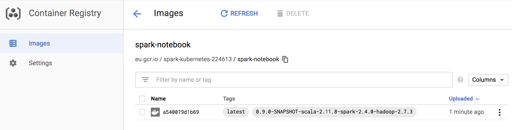
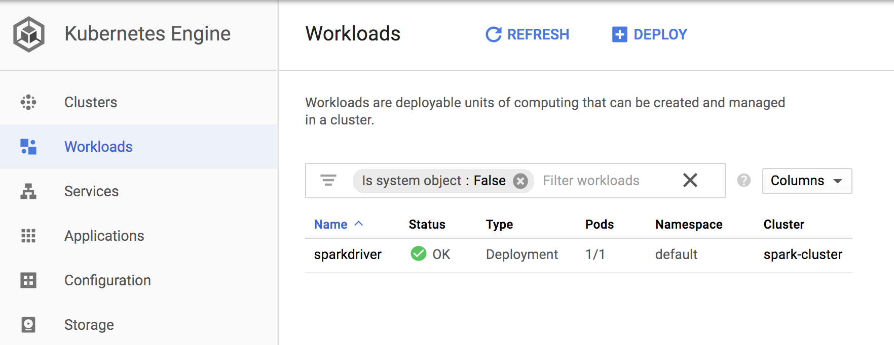
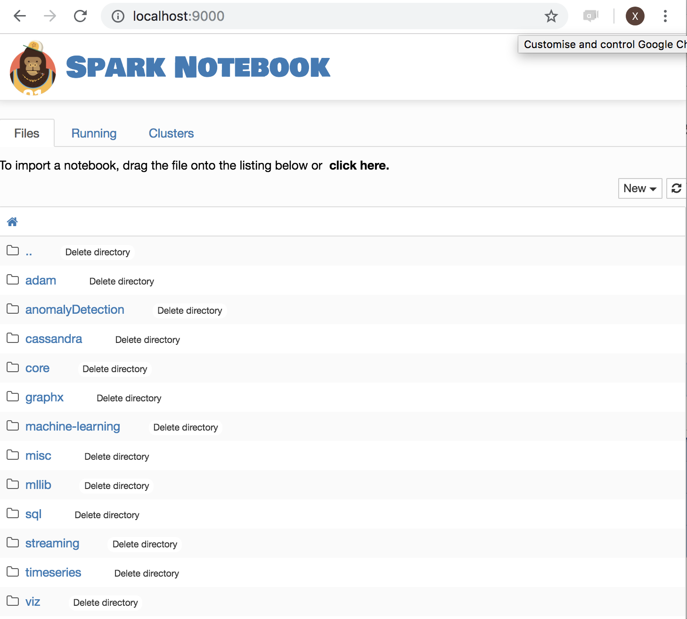
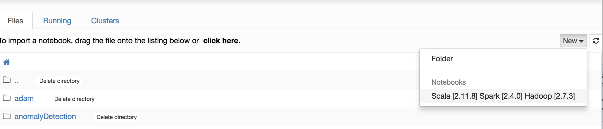
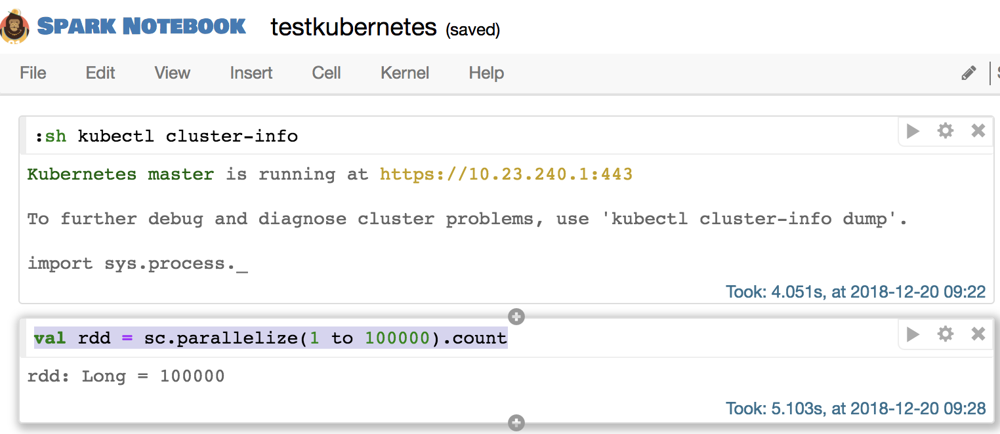
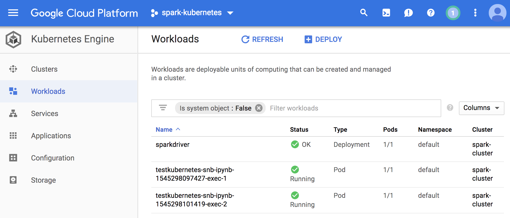

#Running the Spark-notebook on a Kubernetes google cloud cluster

Modern data intensive applications rely on distributed computing and storage to leverage scalability and reliability. We will work with Kubernetes on google cloud for the infrastructure layer, but any cloud vendor with a kubernetes service or on premise install of a kubernetes cluster would work. Spark is a popular computing framework and the spark-notebook is used to submit jobs interactivelly.

In this blog, you will learn how to configure a set-up for the spark-notebook to work with kubernetes, in the context of a google cloud cluster.

## 1. Intro to the stack

### 1.1 Spark and the spark-notebook

Spark is one of the post popular distributed computing framework, it was developed as a functional programming enabled version of the map-reduce paradigm with an in-memory caching mechanism to impove performance.

Spark is developed in Scala and provides python and R apis.
Scala spark jobs can be submitted to a spark cluster by 2 main mechanism, either as a submitted application (a jar), or through interactive sessions with a REPL. In both case, the REPL or application need to instanciate a `SparkSession` object, this spark session being the gateway in the application to submit tasks to a spark cluster.

Modern data science is using extensively notebooks, i.e. user interfaces to interact with a computing environment. The spark-notebook is providing the user with web pages for editing code and execute this code in a scala REPL with a SparkSession. This Spark Session can be configured to connect any kind of spark enabled cluster.

Spark has several cluster options:

* *local*: no cluster, just the local resources are used
* *standalone*: the spark native cluster, spark executor has to be started on each node (static set-up).
* *YARN*: the Hadoop yarn scheduler is used to dispatch tasks on a Hadoop cluster
* *mesos*: the spark framework is running on Mesos, instanciating executors/driver on the mesos cluster.
* *Kubernetes*: spark executor/driver are scheduled by kubernetes.


### 1.2 Kubernetes

Kubernetes is a system to automate deployment of containerized applications. In the context of spark, it means spark executors will run as containers.
The spark driver also can be run in kubernetes as a container, this is the so-called `cluster` mode available for spark-submit command.

There are many solutions to get a kubernetes instance running, either single local node for testing, or full production set-up on premises or cloud-based: [https://kubernetes.io/docs/setup/pick-right-solution/]()

We are showing an example on Google Kubernetes Engine so we have a real  multinode cluster without the burden of installation. Alternativelly, Minikube is the popular way to get started with kubernetes in single local node.

From a user perspective, kubernetes is used with the `kubectl` command. `kubectl` must connect to a kubernetes master node to request execution of commands. The scope here is to get kubectl, and configure it to connect to the (gcloud) kubernetes cluster. Spark is dealing for us with the use of kubectl to deploy the spark-executor/driver containers.

### 1.3 gcloud

Google cloud is an extensive suite of services, from infrastructure to AI, storage, or application deployment. Major cloud services vendors like Amazon and Azure provide equivalent servcices and could be substitued for your needs.

In this blog, we use specifically the *Kubernetes Engine* and the *Container Registry*.

`gcloud` is a tool to manage google cloud services, i.e. creating projects, clusters, managing data etc. Most actions done on the web ui have an equivalent as a gcloud command.

## 2. Install and Configure

### 2.1 gcloud

This step can be replaced with local or other vendors solutions if a billing account is not an option for you.

#### Create a project

First step is to create a project on you google cloud account with billing enabled.

[https://cloud.google.com/resource-manager/docs/creating-managing-projects]()
[https://cloud.google.com/billing/docs/how-to/modify-project]()

We assume here you have a project named `spark-kubernetes` and the project id generated for you is `spark-kubernetes-224613`.



#### Install and configure gcloud

Install gcloud on your machine, I used homebrew on my MacBook:

```
brew cask install google-cloud-sdk
```

Of course, any of these methods is an alternative option depending on your set-up:

[https://cloud.google.com/sdk/install]()

`gcloud` must be configured to work with your project and credentials with the command:

```
gcloud init
```

This will open a browser window to login into your google account and will allow you to select your project as the default one. You can also manually pick your project:

```
gcloud config set core/project spark-kubernetes-224613
```

This makes our project as the default one for every `gcloud` call.


`gcloud config list` should show your project is the one selected.

#### Create a kubernetes cluster

On the google cloud web dashboard, select Kubernetes Engine -> Clusters -> Create Cluster. Note that the first time kubernetes is set-up on your project , it may take a few minutes to complete.

I picked `Standard cluster` with 3 nodes (2vCPU, 4 GB RAM per node), so I have a cluster with enough resources to run spark jobs, with a couple of spark executors.




### 2.2 kubectl

#### Install `kubectl`

kubectl can be installed by different ways, I used homebrew install on my development machine, for other options/environments, see:

[https://kubernetes.io/docs/tasks/tools/install-kubectl/]()

#### Configure `kubectl`

`kubectl` must connect to a cluster in a context (relating users to clusters). General information on this step is given here: [https://kubernetes.io/docs/tasks/tools/install-kubectl/#configure-kubectl]()

For our google cloud cluster, we leave it to gcloud to create a configuration for the cluster `spark-cluster`:

```
gcloud container clusters get-credentials spark-cluster
```

This will configure kubectl to use the cluster and context, you can check with:

```
$ kubectl config get-clusters
NAME
docker-for-desktop-cluster
gke_spark-kubernetes-224613_europe-west1-b_spark-cluster
```

```
$ kubectl config current-context
gke_spark-kubernetes-224613_europe-west1-b_spark-cluster
```

The context is connecting to the Google Kubernetes cluster we just created. We are ready to work with our infrastructure with kubernetes now.

### 2.3 Spark install and config

Spark on kubernetes started at version 2.3.0, in cluster mode where a jar is submitted and a spark driver is created in the cluster (cluster mode of spark).
From Spark version 2.4, the client mode is enables. This mode is required for spark-shell and notebooks, as the driver is the spark-shell jvm itself.

To run spark on kubernetes, spark docker images must be available on a registry. We will push these images on the google registry of our project.

Spark proivides a tool to build images and push to a registry. It would be possible to extend these base images in more advanced cases, for example where you want some libraries to be intalled on spark executors.

#### Download and install

You can download a spark build from here:

[https://spark.apache.org/downloads.html]()

I installed version 2.4.0 for hadoop 2.7, in ` /opt`:

```
cd /opt/spark-2.4.0-bin-hadoop2.7/
```

For referencem the Dockerfile to build the images are in the `kubernetes` subdirectory, and the docker tool is in `bin`.

#### Publish spark images to docker registry

Note: it is assumed you have docker installed and running on your machine.

First, you need to build the spark images, we basically follow here the spark documentation on [https://spark.apache.org/docs/latest/running-on-kubernetes.html]()

The google repository for our `spark-kubernetes-224613` project is (located in Europe), and we specify a tag `test-tag`:

```
$ ./bin/docker-image-tool.sh -r eu.gcr.io/spark-kubernetes-224613 -t test-tag build
$ ./bin/docker-image-tool.sh -r eu.gcr.io/spark-kubernetes-224613 -t test-tag push
```

3 docker container images should appear in your project:



Only the `spark` image is of interest here, the others provide support for the python and R APIs.


#### Spark on kubernetes architecture and networking

The principle behind spark on kubernetes is that a `SparkSession` is configured to request resources, i.e. executors with some memory and CPU. In. order to do this, the Spark application must access the `kubectl` command, with rights to hit to the kubernetes cluster API endpoint and create pods (run containers), this is a first problem to solve. At the same time, to execute tasks, the Spark driver must be accessible from the executors with an IP or hostname, this is a second issue to be addressed.

We cannot have a spark driver running on the development environment easily. The driver will have to run inside the kubernetes cluster as a pod with the right configuration, and access to kubectl. Within the kubernetes cluster, the driver and the executor communicate easily, the network being open.

The spark documentation explains how to submit jobs with spark-submit:

>
> ```
> $ bin/spark-submit \
    --master k8s://https://<k8s-apiserver-host>:<k8s-apiserver-port> \
    --deploy-mode cluster \
    --name spark-pi \
    --class org.apache.spark.examples.SparkPi \
    --conf spark.executor.instances=5 \
    --conf spark.kubernetes.container.image=<spark-image> \
    local:///path/to/examples.jar
>
> ```
>

We need to set-up a solution to get a REPL started (`spark-shell`) with access to kubectl, and within the cluster.

#### Service Accounts, Roles, and Role Bindings

So far, `kubectl` was used by us, a human user. From within the pod hosting the Spark REPL (or notebook), it has to be a *Service Account* using kubectl. This account will have to be bound to some Role, granting rights to create pods for our executors.

See the diagram in:

[https://kubernetes.io/docs/reference/access-authn-authz/controlling-access/]()

We start by creating the *Service Account*, with name `spark-notebook`:


```
kubectl create -f - <<EOF
apiVersion: v1
kind: ServiceAccount
metadata:
  name: spark-notebook
EOF
```

We bind the `edit` role at the cluster level (allowing to create pods) to the `spark-notebook` Service Account we just created:

```
kubectl create rolebinding spark-notebook-pods \
  --clusterrole=edit \
  --serviceaccount=default:spark-notebook \
  --namespace=default

```

When starting the pod hosting the spark REPL, we will use the `spark-notebook` Service Account, and we'll make sure the kubectl is installed in the docker container. This solves the issue of creating the executors from the driver pod.

Here is an example of session, where we run a bash session on the spark image with the `spark-notebook` service account, and we manually install kubectl inside the container. That would be a first step before testing the spark-shell on kubernetes:

```
$ kubectl run spark-bash-session --rm -i --tty --image eu.gcr.io/spark-kubernetes-224613/spark:test-tag --serviceaccount spark-notebook -- bash
If you don't see a command prompt, try pressing enter.
bash-4.4#
```

At that point we have a bash session running inside a pod, let's install kubectl:

```
bash-4.4# wget "https://storage.googleapis.com/kubernetes-release/release/v1.6.4/bin/linux/amd64/kubectl"
bash-4.4# chmod +x kubectl
bash-4.4# mv kubectl /usr/local/bin/
bash-4.4#

```

We can check that kubectl sees the pods:

```
bash-4.4# kubectl get pods
NAME                                  READY     STATUS    RESTARTS   AGE
spark-bash-session-55695fd589-2r9lp   1/1       Running   0          3m
```

And check we have creation rights for pods:

```
bash-4.4# kubectl auth can-i create pods
yes
```

Without the `spark-notebook` Account Service, it wouldn't be allowed.

#### Expose the driver to executors: Headless Service

We know that the driver has to be accessible from the executors. The default spark set-up gives a hostname to the driver that is not working, so we need to fix it. This is done with the concept of kubernetes Services.

A *headless* service will expose the pod, but without loadbalancer or IP, just with a chosen hostname, we do this from the development machine to expose the pod with label *app=sparkdriver*.

```
kubectl create -f - <<EOF
apiVersion: v1
kind: Service
metadata:
  name: sparkdriver
  labels:
    app: sparkdriver
spec:
  clusterIP: None
  type: ClusterIP
  ports:
    - port: 4040 # <-- spark UI
  selector:
    app: sparkdriver
EOF
```

With this service up, the pod will resolve to `sparkdriver` and we will just need to set this name as the *spark.driver.host* configuration value.

#### Manual test for spark-shell (REPL)

We can now test if the spark REPL can get executors up on the kubernetes cluster and task executed, this is the last requirement before working on the spark-notebook deplopyment.

##### Prepare spark-shell driver pod

We can run the spark image with a bash shell like previously, taking care of setting the label *app=sparkdriver*:

```
kubectl run spark-shell --rm -i --tty --image eu.gcr.io/spark-kubernetes-224613/spark:test-tag --serviceaccount spark-notebook --labels app=sparkdriver -- bash
```
**Note**: the shell is now the spark container in the cluster

We can check that the `sparkdriver` name is resolved:

```
nslookup sparkdriver
nslookup: can't resolve '(null)': Name does not resolve

Name:      sparkdriver
Address 1: 10.20.2.40 spark-notebook-f58966f-4292z
```

We install kubectl (for the spark-notebook, we will create a custom docker image...):

```
wget "https://storage.googleapis.com/kubernetes-release/release/v1.6.4/bin/linux/amd64/kubectl"
chmod +x kubectl
mv kubectl /usr/local/bin/
```

And we go into the spark installation directory:

```
cd /opt/spark
```
##### Run spark-shell

Compared to the spark-submit command we have seen before, as we work with the spark-shell, these configurations are not needed:

- *-deploy-mode* because the spark driver is the spark-shell container
- *--class* There is no main class to provide, we work interactively, the main class was provided by spark-shell

No `jar` for the application is given either.

We need to override defaults for the following:

- *spark.kubernetes.executor.limit.cores* must be set to 1 (We have 1 core per node, thus maximum 1 core per pod, i.e. kubernetes container)
- *spark.kubernetes.executor.request.cores* is set to 100 milli-CPU, so we start with low resources


Finally, the cluster url is obtained with `kubectl cluster-info`, on my set-up it was:

```
$ kubectl cluster-info
Kubernetes master is running at https://10.23.240.1
```

And the command to run spark-shell is:


```
bin/spark-shell \
    --master k8s://https://10.23.240.1 \
    --name spark-kub \
    --conf spark.driver.host=sparkdriver \
    --conf spark.executor.instances=2 \
    --conf spark.kubernetes.executor.request.cores=100m \
    --conf spark.kubernetes.executor.limit.cores=1 \
    --conf spark.kubernetes.container.image=eu.gcr.io/spark-kubernetes-224613/spark:test-tag
```

A spark shell prompt apprears:

```
2018-12-06 16:23:48 WARN  NativeCodeLoader:62 - Unable to load native-hadoop library for your platform... using builtin-java classes where applicable
Setting default log level to "WARN".
To adjust logging level use sc.setLogLevel(newLevel). For SparkR, use setLogLevel(newLevel).
Spark context Web UI available at http://sparkdriver:4040
Spark context available as 'sc' (master = k8s://https://10.23.240.1, app id = spark-application-1544113440860).
Spark session available as 'spark'.
Welcome to
      ____              __
     / __/__  ___ _____/ /__
    _\ \/ _ \/ _ `/ __/  '_/
   /___/ .__/\_,_/_/ /_/\_\   version 2.4.0
      /_/

Using Scala version 2.11.12 (OpenJDK 64-Bit Server VM, Java 1.8.0_181)
Type in expressions to have them evaluated.
Type :help for more information.

scala>
```

And the google cloud UI shows the sparkdriver and executors pods:



We can test that a simple job executes in the cluster:

```
scala> sc.parallelize(1 to 1000000).count
res1: Long = 1000000
```

The spark REPL being functional, we can start with the spark-notebook.

### 2.4 Spark-notebook

#### Build/push a docker image for the spark-notebook

The spark-notebook is a web application with sources available in github:

[https://github.com/spark-notebook/spark-notebook]()

We need to get the source code:

```
git clone https://github.com/spark-notebook/spark-notebook.git

cd spark-notebook
```

Then we must provide a configuration for the docker image build, for this we start from the provided template:

```
cp .docker.build.conf.kubernetes.example .docker.build.conf
```

And edit the file to set the right maintainer and registry, for example:

```
$ cat .docker.build.conf
docker {
  maintainer = "Xavier Tordoir"
  registry = "eu.gcr.io/spark-kubernetes-224613"
  commands = [
    { cmd = USER, arg = root },
    { cmd = RUN, arg = "apt-get update --fix-missing && apt-get install -y -t jessie-backports --no-install-recommends openjdk-8-jdk" },
    { cmd = ENV, arg = "JAVA_HOME /usr/lib/jvm/java-8-openjdk-amd64" },
    { cmd = RUN, arg = "apt-get install -y wget curl"},
    { cmd = ADD, arg = "https://storage.googleapis.com/kubernetes-release/release/v1.6.4/bin/linux/amd64/kubectl /usr/local/bin/kubectl" },
    { cmd = RUN, arg = "chmod +x /usr/local/bin/kubectl" }
  ]
}
```

As you see, this docker build configuration installs java (required to run the spark-notebook) and kubectl (required for kubernetes support -- creation of executor pods) in the container.

You are now ready to build the spark-notebook image, specifying the spark version and request for kubernetes support with sbt:

```
sbt -Dspark.version=2.4.0 -Dwith.kubernetes=true docker:publishLocal
```

This builds the image locally, with a tag corresponding to the versions of the spark-notebook, scala, spark and hadoop, in my case:

```
$ docker images
REPOSITORY                                         TAG                                                    IMAGE ID            CREATED             SIZE
eu.gcr.io/spark-kubernetes-224613/spark-notebook   0.9.0-SNAPSHOT-scala-2.11.8-spark-2.4.0-hadoop-2.7.3   e854fd7b63de        7 seconds ago       1.27GB
```

We can push this image to the docker registry, after adding the `latest` tag:

```
export FULLTAG=0.9.0-SNAPSHOT-scala-2.11.8-spark-2.4.0-hadoop-2.7.3

docker tag eu.gcr.io/spark-kubernetes-224613/spark-notebook:$FULLTAG eu.gcr.io/spark-kubernetes-224613/spark-notebook:latest

docker push eu.gcr.io/spark-kubernetes-224613/spark-notebook
```

The result is visible on the registry page:



#### Create a spark-notebook deployment

We have now everything in place to start a spark-notebook server instance.

We will use a deployment yaml config file named `spark-notebook.yml`. It specifies that we want a single instance (the service is stateful), it will be labelled `sparkdriver` so it will be recognized by the service we created to obtain a hostname, and is run with the ServiceAccount named `spark-notebook` so the pod has the rights to create executor pods:

```
apiVersion: "extensions/v1beta1"
kind: "Deployment"
metadata:
  name: "sparkdriver"
  namespace: "default"
  labels:
    app: "sparkdriver"
spec:
  replicas: 1
  selector:
    matchLabels:
      app: "sparkdriver"
  template:
    metadata:
      labels:
        app: "sparkdriver"
    spec:
      serviceAccountName: "spark-notebook"
      containers:
      - name: "spark-notebook"
        image: "eu.gcr.io/spark-kubernetes-224613/spark-notebook:latest"
```

And we create this deployment in our cluster:

```
kubectl create -f spark-notebook.yml
```

The appliocation is started after a little while:




We need to expose the spark-notebook for us to use it, we could use a loadBalancer and expose it to the public, but it would require to configure some security.

Instead, port forwarding will work to get a simple private access to the application:

We identify the pod running the spark notebook:

```
$ kubectl get pods
NAME                           READY     STATUS    RESTARTS   AGE
sparkdriver-77b76546fd-5ms8b   1/1       Running   0          6m
```

We create the port forwarding rule:

```
kubectl port-forward sparkdriver-77b76546fd-5ms8b 9000:9000
```

Open [http://localhost:9000]() and you should have the spark-notebook server page:



#### Create and configure a notebook

The next step is to create a notebook, and configure it to use the kubernetes cluster for executors:

Create a new notebook:



A new browser tab opens with an empty notebook. By default, spark is started in local mode. To override this behaviour, you must edit the notebook metadata (Menu *Edit* -> *Edit Notebook Metadata*).

The json should have a `"customSparkConf"` property like:

```
"customSparkConf": {
  "spark.master"  : "k8s://https://10.23.240.1",
  "spark.app.name": "spark-kubernetes",
  "spark.driver.host": "sparkdriver",
  "spark.executor.instances":"2",
  "spark.kubernetes.executor.request.cores": "100m",
  "spark.kubernetes.executor.limit.cores": "1",
  "spark.kubernetes.container.image": "eu.gcr.io/spark-kubernetes-224613/spark:test-tag"
}
```

>Note: if you are not sure about the `spark.master` url, you can execute the following in a notebook cell (hit ctrl-Enter after editing a cell):
>
>```
>:sh kubectl cluster-info
>```
>
>This will execute the command in the spark-notebook pod, and return the kubernetes master IP as needed.
>

Save the notebook (Menu *File* -> *Save*) then reload the Kernel to take the new configuration into account (Menu *Kernel* -> *Reload*)

#### Run some spark command on the cluster

We can now edit a new cell and execute code with some computation on the cluster:

```
val rdd = sc.parallelize(1 to 100000).count
```

This will require spark to start executor pods in the kubernetes cluster, and here are the results:



On the kubernetes UI, we see 2 executors running, as expected:



## Takeaways

The work of deploying the spark-notebook on kubernetes got us to cover a range of features of kubernetes like pods, services, roles, service accounts, some networking, port forwarding.

Also, it required to understand how spark is working on a cluster, what the REPL mode is and how the spark-notebook works, i.e a web application on top of the spark REPL.

We also got to see how gcloud is providing kubernetes clusters to work with.

## Where to go from here

There is still quite some way to cover in order to have a fully working environment. The details will be discussed in a separate post:

**Default notebook configuration**

We want to avoid editing the notebooks metadata and reload the kernel, by just getting a default configuration. The spark-notebook allows to edit server configuration files in order to achieve this.

**Secure notebook access**

Working through port forwarding is not the way to go in a team using the spark-notebook server. Authentication should be enabled on the spark-notebook and a service exposing the pod should also be started, with the right security layer enabled.

**Deal with state**

Notebooks are json files stored on the local filesystem of the server. Failure/restart of the spark-notebook pod will result in loss of the work.

The spark-notebook integrates with git, and kubernetes provides persistent volumes, this would allow to retain the state of the application (notebook persistence).

**Productize as a configurable recipe**

With an understanding of the deployment details, it would be good to work on organising the code the provide easy to use recipes to deploy pre-configured spark-notebook environments, eventually providing java dependencies for advanced spark use cases.
